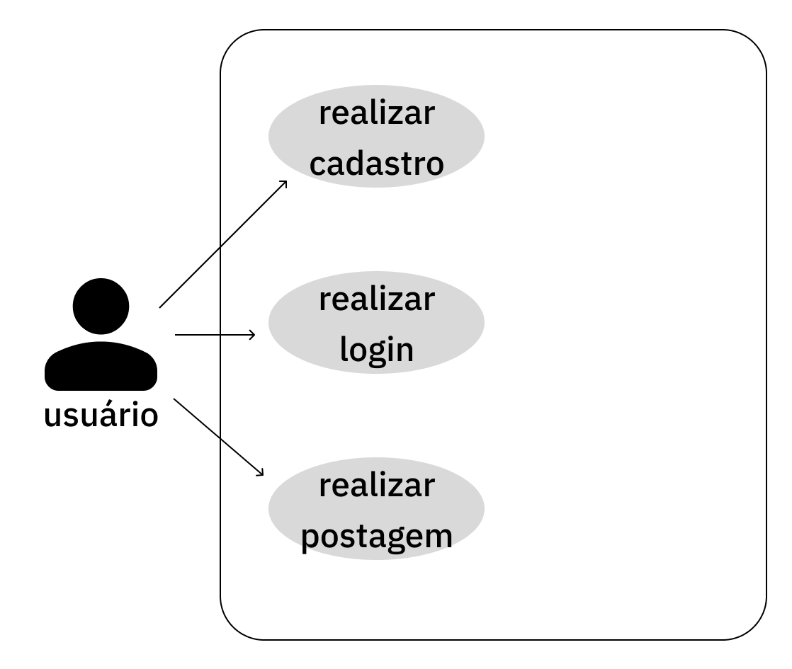

# mEnSi

> Uma rede social para entusiastas de tecnologia compartilharem seus conhecimentos e se conectarem pelos interesses.

mEnSi é uma rede social de fórum, inspirada no Reddit e com o estilo de postagem do Tumblr. O projeto surge na tentativa de melhorar a experiência dos amantes de tecnologia dentro das redes sociais, trazendo um espaço dedicado, organizado e focado para este público.

---

### Índice

- [Sobre o Projeto](#sobre-o-projeto)
- [Funcionalidades](#-funcionalidades)
- [Tecnologias Utilizadas](#-tecnologias-utilizadas)
- [Como Executar o Projeto](#️-como-executar-o-projeto)
- [Autor](#-autor)
- [Licença](#-licença)

---

### ✨ Funcionalidades

- [x] Cadastro de Usuário
- [x] Autenticação (Login)
- [x] Criação de Postagens
- [x] Feed Principal (Tela Home)
- [ ] Comentar em postagens _(próxima feature)_
- [ ] Sistema de votos _(próxima feature)_

---

### 🚀 Tecnologias Utilizadas

Este projeto foi desenvolvido utilizando as seguintes tecnologias:

- **Mobile:** React Native com Expo
- **Backend:** Node.js
- **Banco de Dados:** PostgreSQL
- **Design:** Figma

---

## Diagrama de casos de uso

